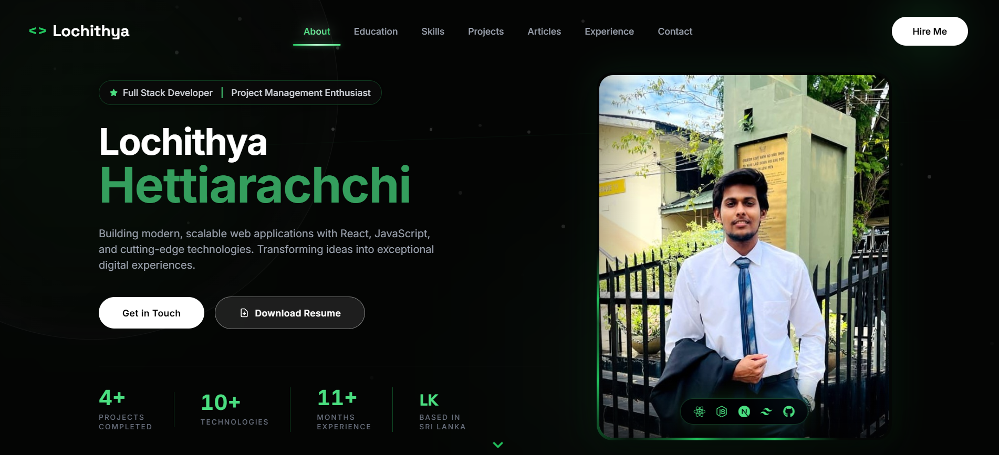

# 🌟 Personal Portfolio Website

A modern, responsive personal portfolio website built with React.js, featuring smooth animations, dark mode theming, and an elegant glassmorphism design. This portfolio showcases my projects, skills, experience, and technical articles in an interactive and visually appealing manner.

[](https://lochithya.netlify.app/)
[](https://reactjs.org/)
[](https://tailwindcss.com/)
[](https://vitejs.dev/)
[](LICENSE)

## 📸 Preview



## ✨ Features

- 🎨 **Modern UI/UX Design** - Clean, professional interface with glassmorphism effects
- 🌓 **Dark Mode** - Default dark theme with smooth transitions
- ✨ **Smooth Animations** - Powered by Framer Motion for fluid interactions
- 📱 **Fully Responsive** - Optimized for all devices and screen sizes
- 🚀 **Fast Performance** - Built with Vite for lightning-fast load times
- 📧 **Contact Integration** - EmailJS integration for direct communication
- 🎯 **Smooth Scrolling** - Seamless navigation between sections
- 🎭 **Interactive Components** - Engaging UI elements and hover effects
- 📝 **Blog Integration** - Showcase technical articles and writings
- 🎨 **Custom Animations** - Animated stars and gradient effects

## 🛠️ Tech Stack

### Frontend
- **React.js** (18.3.1) - UI library
- **Vite** (5.3.1) - Build tool and dev server
- **Tailwind CSS** (3.4.4) - Utility-first CSS framework
- **Framer Motion** (11.11.1) - Animation library
- **React Scroll** (1.9.0) - Smooth scrolling navigation
- **React Icons** (5.3.0) - Icon library

### Additional Tools
- **EmailJS** (4.4.1) - Email service integration
- **PostCSS** & **Autoprefixer** - CSS processing
- **ESLint** - Code linting and quality

## 📂 Project Structure

```
Personal-Portfolio/
├── public/
│   ├── images/
│   │   ├── hero/               # Profile images
│   │   ├── projects/           # Project screenshots
│   │   └── articles/           # Article thumbnails
│   ├── resume/                 # Resume files
│   └── icons.svg               # SVG icons
├── src/
│   ├── components/
│   │   ├── ui/                 # Reusable UI components
│   │   ├── About.jsx
│   │   ├── Articles.jsx
│   │   ├── Contact.jsx
│   │   ├── Education.jsx
│   │   ├── Experience.jsx
│   │   ├── Footer.jsx
│   │   ├── Hero.jsx
│   │   ├── Navbar.jsx
│   │   ├── Projects.jsx
│   │   └── Skills.jsx
│   ├── data/                   # Data files for content
│   │   ├── articles.js
│   │   ├── education.js
│   │   ├── experience.js
│   │   ├── personalInfo.js
│   │   ├── projects.js
│   │   └── skills.js
│   ├── App.jsx                 # Main app component
│   ├── main.jsx                # Entry point
│   └── index.css               # Global styles
├── index.html
├── tailwind.config.js
├── vite.config.js
└── package.json
```

## 🚀 Getting Started

### Prerequisites

- Node.js (v16 or higher)
- npm or yarn package manager

### Installation

1. **Clone the repository**
   ```bash
   git clone https://github.com/Lochithya/Personal-Portfolio.git
   cd Personal-Portfolio
   ```

2. **Install dependencies**
   ```bash
   npm install
   ```

3. **Set up environment variables**
   
   Create a `.env` file in the root directory:
   ```env
   VITE_EMAILJS_SERVICE_ID=your_service_id
   VITE_EMAILJS_TEMPLATE_ID=your_template_id
   VITE_EMAILJS_PUBLIC_KEY=your_public_key
   ```

4. **Start the development server**
   ```bash
   npm run dev
   ```

5. **Open your browser**
   
   Navigate to `http://localhost:5173`

## 📦 Build for Production

```bash
npm run build
```

The optimized production build will be generated in the `dist/` directory.

### Preview Production Build

```bash
npm run preview
```

## 🎨 Customization

### Update Personal Information

Edit the data files in `src/data/` to customize your portfolio content:

- `personalInfo.js` - Name, title, bio, contact info
- `projects.js` - Project details and links
- `skills.js` - Technical skills and proficiencies
- `experience.js` - Work experience and roles
- `education.js` - Educational background
- `articles.js` - Blog posts and articles

### Modify Styling

- **Colors**: Edit `tailwind.config.js` to change the color scheme
- **Fonts**: Update font imports in `index.html` and `tailwind.config.js`
- **Animations**: Customize Framer Motion animations in component files

### Add New Sections

1. Create a new component in `src/components/`
2. Import and add it to `App.jsx`
3. Update navigation links in `Navbar.jsx`

## 📧 EmailJS Setup

1. Create an account at [EmailJS](https://www.emailjs.com/)
2. Create an email service
3. Create an email template
4. Copy your Service ID, Template ID, and Public Key
5. Add them to your `.env` file

## 🌐 Deployment

### Deploy to Vercel

### Deploy to Netlify [Followed Prodecure to Deploy]

```bash
npm run build
# Drag and drop the dist/ folder to Netlify
```

```bash
npm install -g vercel
vercel
```

### Deploy to GitHub Pages

```bash
npm install gh-pages --save-dev
```

Add to `package.json`:
```json
"scripts": {
  "predeploy": "npm run build",
  "deploy": "gh-pages -d dist"
}
```

Run:
```bash
npm run deploy
```

## 📱 Sections

- **Hero** - Introduction with animated background
- **About** - Personal bio and statistics
- **Education** - Academic background
- **Skills** - Technical skills with proficiency levels
- **Projects** - Portfolio of completed projects
- **Articles** - Technical blog posts and writings
- **Experience** - Professional work experience
- **Contact** - Contact form with EmailJS integration
- **Footer** - Social links and copyright

## 🎯 Performance Optimizations

- ⚡ Vite for fast builds and HMR
- 🖼️ Optimized images (WebP format)
- 📦 Code splitting and lazy loading
- 🎨 Tailwind CSS purging for minimal CSS
- 🚀 Production build optimization


## 👤 Author

**Lochithya Hettiarachchi**

- GitHub: [@Lochithya](https://github.com/Lochithya)
- LinkedIn: [Lochithya Hettiarachchi](https://www.linkedin.com/in/lochithya-hettiarachchi)
- Medium: [@lochithya12](https://medium.com/@lochithya12)
- Email: lochithya12@gmail.com

